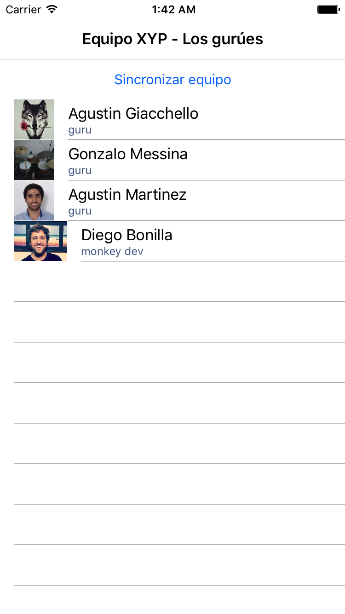

# XYP07

## Contiene 3 directorios:

 - EjemploViewModel
 
 > Muestra un ejemplo de cómo definir los view models
 
 - Start
 
 > Fody para Bindings
 
 > Otra forma de definir ViewModel
 
 - End 
 > Solución completa

## Lab

Desarrollar una app para iOS, Android y UWP que contenga dos pantallas y haga uso de:

 - HttpClient
 - Azure Mobile Client
 - DependencyService
 - TextToSpeech

 

- Obtener equipo de https://demo8208387.mockable.io/xypteam
	- tip: *GetStringAsync* y *JsonConvert*

- XAML
	- tip

```xml 
		<ListView ItemsSource="{Binding Members}">
          <ListView.ItemTemplate>
            <DataTemplate>
              <ImageCell Text="{Binding Name}"
                         Detail="{Binding Title}"
                         ImageSource="{Binding Avatar}"/>
            </DataTemplate>
          </ListView.ItemTemplate>
        </ListView>
```

- Obtener equipo de Azure
	- configurar Mobile app 
	- cargar easy table con Member.csv
	- tip 

```csharp
	public async Task Initialize()
		{
			if (Client?.SyncContext?.IsInitialized ?? false)
            {
				return;
            }

			var appUrl = "https://xypteam.azurewebsites.net";

			//Create our client
			Client = new MobileServiceClient(appUrl);

			//InitialzeDatabase for path
			var path = "syncstore.db";
			path = Path.Combine(MobileServiceClient.DefaultDatabasePath, path);

			//setup our local sqlite store and intialize our table
			var store = new MobileServiceSQLiteStore(path);

			//Define table
			store.DefineTable<Member>();

			//Initialize SyncContext
			await Client.SyncContext.InitializeAsync(store, new MobileServiceSyncHandler());

			//Get our sync table that will call out to azure
			table = Client.GetSyncTable<Member>();
		}

		public async Task<IEnumerable<Member>> GetSpeakers()
		{
			await Initialize();
			await SyncMembers();
			return await table.OrderBy(s => s.Name).ToEnumerableAsync();
		}

		public async Task SyncMembers()
		{
			try
			{
				await Client.SyncContext.PushAsync();
				await table.PullAsync("allMembers", table.CreateQuery());
			}
			catch (Exception ex)
			{
                Debug.WriteLine("No se ha podido sincronizar, no pasa nada porque tenemos funcionalidades offline ;-) : " + ex);
			}
		}
```

- Command Func<object, bool> canExecute 
